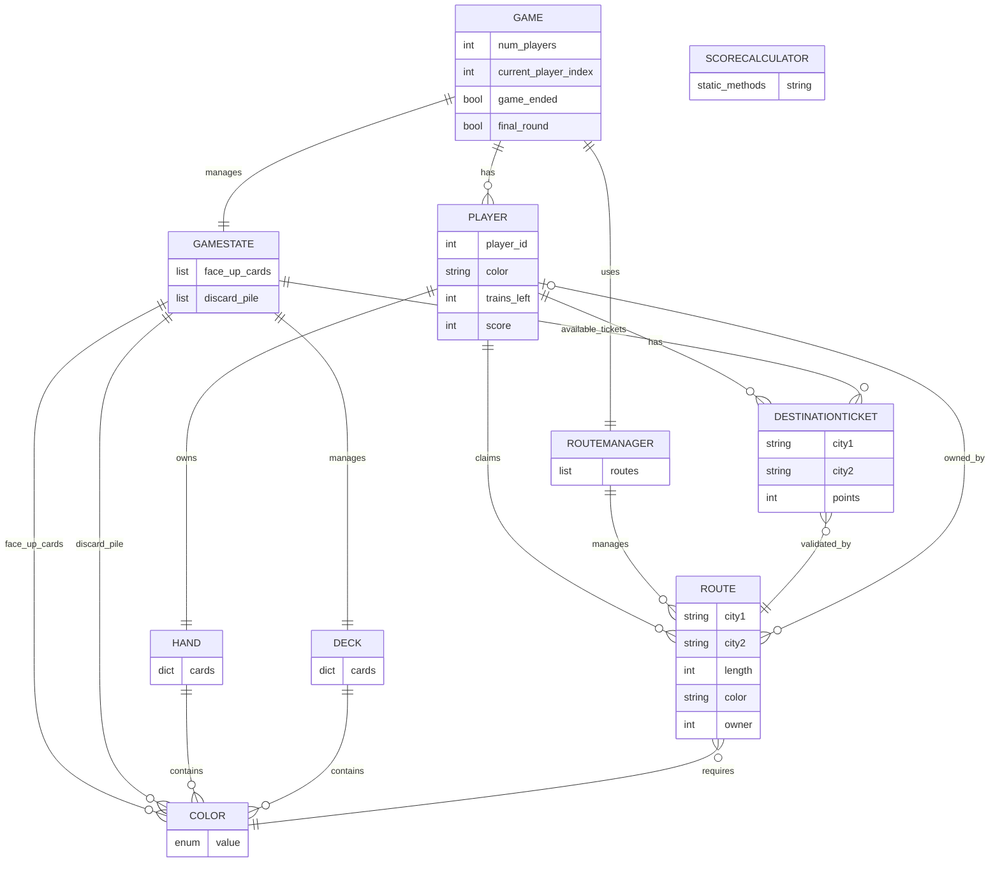

```mermaid
erDiagram
    GAME ||--o{ PLAYER : has
    GAME ||--|| GAMESTATE : manages
    GAME ||--|| ROUTEMANAGER : uses

    PLAYER ||--|| HAND : owns
    PLAYER ||--o{ DESTINATIONTICKET : has
    PLAYER ||--o{ ROUTE : claims

    GAMESTATE ||--|| DECK : manages
    GAMESTATE ||--o{ COLOR : face_up_cards
    GAMESTATE ||--o{ COLOR : discard_pile
    GAMESTATE ||--o{ DESTINATIONTICKET : available_tickets

    ROUTEMANAGER ||--o{ ROUTE : manages

    HAND ||--o{ COLOR : contains

    DECK ||--o{ COLOR : contains

    ROUTE }o--|| COLOR : requires
    ROUTE }o--o| PLAYER : owned_by

    DESTINATIONTICKET }o--|| ROUTE : validated_by

    GAME {
        int num_players
        int current_player_index
        bool game_ended
        bool final_round
    }

    PLAYER {
        int player_id
        string color
        int trains_left
        int score
    }

    HAND {
        dict cards
    }

    GAMESTATE {
        list face_up_cards
        list discard_pile
    }

    DECK {
        dict cards
    }

    ROUTE {
        string city1
        string city2
        int length
        string color
        int owner
    }

    DESTINATIONTICKET {
        string city1
        string city2
        int points
    }

    ROUTEMANAGER {
        list routes
    }

    COLOR {
        enum value
    }

    SCORECALCULATOR {
        static_methods string
    }
```
