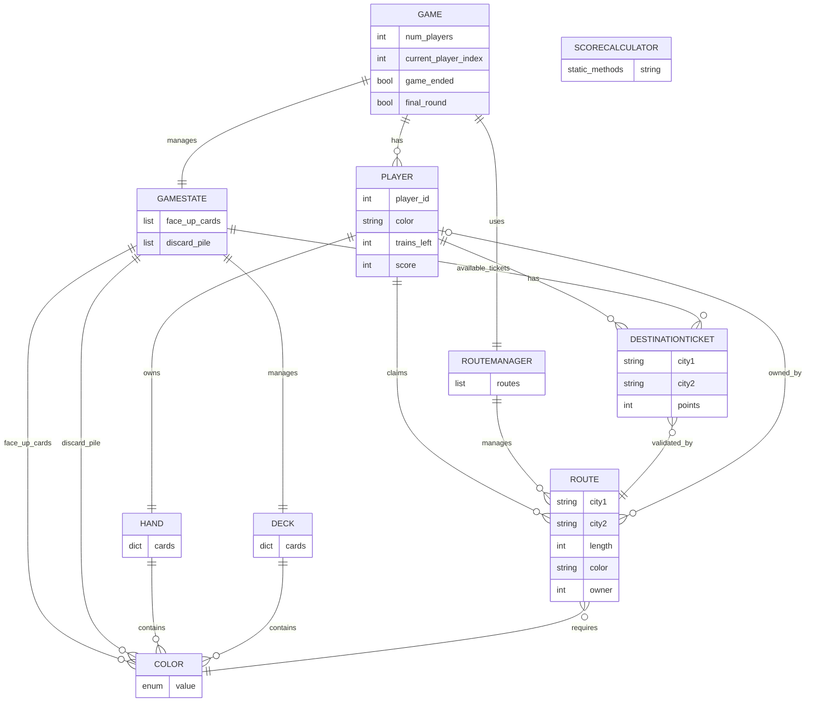

# Entity Relationship Diagram

This diagram illustrates the relationships between the main classes and data structures in the Ticket to Ride game implementation.

## Mermaid ER Diagram



## Entity Descriptions

### GAME
The main game controller that manages the overall game state, players, and turn order.

**Attributes:**
- `num_players`: Number of players (2-5)
- `current_player_index`: Index of the player whose turn it is
- `game_ended`: Boolean flag indicating if the game has ended
- `final_round`: Boolean flag indicating if the final round has been triggered

**Relationships:**
- Has multiple PLAYERs
- Manages one GAMESTATE
- Uses one ROUTEMANAGER

### PLAYER
Represents a single player in the game.

**Attributes:**
- `player_id`: Unique identifier for the player
- `color`: Player's color (RED, BLUE, GREEN, YELLOW, BLACK)
- `trains_left`: Number of train pieces remaining (starts at 45)
- `score`: Current score from claimed routes

**Relationships:**
- Owns one HAND
- Has multiple DESTINATIONTICKETs
- Claims multiple ROUTEs

### HAND
A player's collection of train cards.

**Attributes:**
- `cards`: Dictionary mapping Color enum to count of cards

**Relationships:**
- Contains multiple COLOR cards

### GAMESTATE
Manages the shared game state including the deck and face-up cards.

**Attributes:**
- `face_up_cards`: List of 5 face-up cards available for drawing
- `discard_pile`: List of discarded cards

**Relationships:**
- Manages one DECK
- Contains face-up COLOR cards
- Contains discarded COLOR cards
- Manages available DESTINATIONTICKETs

### DECK
The draw pile of train cards.

**Attributes:**
- `cards`: Dictionary mapping Color enum to count of cards remaining

**Relationships:**
- Contains multiple COLOR cards

### ROUTE
A connection between two cities on the game board.

**Attributes:**
- `city1`: First city name
- `city2`: Second city name
- `length`: Number of train pieces required (1-6)
- `color`: Required color of train cards (or GREY for any color)
- `owner`: Player who claimed this route (None if unclaimed)

**Relationships:**
- Requires a specific COLOR (unless GREY)
- Can be owned by a PLAYER

### DESTINATIONTICKET
A destination card that awards points if the two cities are connected.

**Attributes:**
- `city1`: First city name
- `city2`: Second city name
- `points`: Points awarded if completed (negative if failed)

**Relationships:**
- Validated by checking if ROUTEs connect the two cities

### ROUTEMANAGER
Manages all available routes on the game board.

**Attributes:**
- `routes`: List of all ROUTE objects

**Relationships:**
- Manages multiple ROUTEs

### COLOR
Enumeration of train card colors.

**Values:**
- RED, BLUE, GREEN, YELLOW, ORANGE, BLACK, SILVER, PURPLE, JOLLY, GREY

### SCORECALCULATOR
Utility class with static methods for calculating final scores.

**Methods:**
- `calculate_final_scores(players)`: Calculate scores including destination tickets
- `longest_route_bonus(players)`: Determine player with longest continuous route

## Relationship Details

### GAME → PLAYER (1:N)
A game has 2-5 players. Each player takes turns in order.

### PLAYER → HAND (1:1)
Each player has exactly one hand containing their train cards.

### PLAYER → DESTINATIONTICKET (1:N)
Each player can have multiple destination tickets. They must keep at least one when drawing new tickets.

### PLAYER → ROUTE (1:N)
A player can claim multiple routes during the game, up to 45 train pieces total.

### GAMESTATE → DECK (1:1)
The game state manages a single deck of train cards.

### ROUTEMANAGER → ROUTE (1:N)
The route manager contains all routes available on the board.

### ROUTE → COLOR (N:1)
Each route requires a specific color of train cards (or GREY for any color).

### DESTINATIONTICKET → ROUTE (N:N)
A destination ticket is completed if there exists a path of claimed routes connecting the two cities.

## Usage in Code

### Creating a Game

```python
from game import Game
from map import TicketToRideMap

ttr_map = TicketToRideMap()
ttr_map.load_graph("src/map/city_locations.json", "src/map/routes.csv")
graph = ttr_map.get_graph()

game = Game(number_of_players=3, graph=graph)
game.setup()
```

### Accessing Relationships

```python
# Get current player
player = game.current_player()

# Access player's hand
hand = player.hand
cards = hand.cards  # Dict[Color, int]

# Access player's routes
routes = player.routes  # List[Route]

# Access player's destination tickets
tickets = player.destination_tickets  # List[DestinationTicket]

# Check if a route can be claimed
can_claim = player.hand.can_claim_route(route, color_to_use)
```
