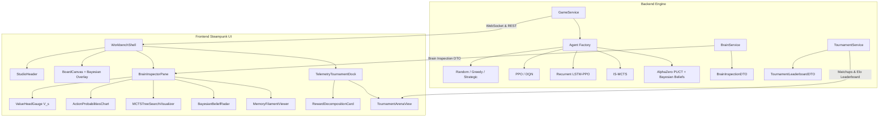

# Design Spec: Full Integration of Lessons 1–12 into the Steampunk Workbench Lab

**Date:** 2026-08-25  
**Status:** Validated Design / Spec  
**Target:** Full Lab Suite (`frontend/src/`, `src/api/`, `src/agents/`, `src/rl/`)

---

## 1. Executive Summary & Goals

The Ticket to Ride Reinforcement Learning Lab contains a comprehensive algorithmic stack developed across 12 iterative curriculum lessons:
1. **Lesson 1**: Core Board Game Engine & Ticket Verification
2. **Lesson 2**: Baseline & Heuristic Agents (Random, Greedy, Heuristic, Strategic Dijkstra)
3. **Lesson 3**: Gymnasium Observation Vector, Action Space & Action Masking
4. **Lesson 4**: First RL Architectures (DQN & PPO Masked Networks)
5. **Lesson 5**: Web Lab Workbench & Live WebSocket Telemetry Stream
6. **Lesson 6**: CleanRL PPO from Scratch (GAE, Advantage Normalization, Orthogonal Init)
7. **Lesson 7**: Reward Hierarchy & Reward Shaping Decomposition
8. **Lesson 8**: Partial Observability & Recurrent LSTM-PPO Memory Architectures
9. **Lesson 9**: Self-Play Policy Pool & Matchmaking Strategies (PFSP)
10. **Lesson 10**: Generalization & Multi-Map / Procedural Topologies
11. **Lesson 11**: Information Set Monte Carlo Tree Search (IS-MCTS)
12. **Lesson 12**: AlphaZero Neural MCTS, PUCT Search & Bayesian Opponent Ticket Belief Tracking

This specification defines the unified architecture to expose **all 12 lessons** inside the **Victorian Steampunk Analytical Workbench**, providing real-time neural and search tree introspection, Bayesian belief cartographic overlays, reward decomposition, and universal 8-agent tournament matchmaking.

---

## 2. Architecture & System Data Flow

---

## 3. Detailed Component Specifications

### 3.1. Backend API & Agent Service Upgrades

1. **`src/api/schemas.py` Extensions**:
   - `MCTSNodeDTO`: Action, visit count $N(s,a)$, mean action value $Q(s,a)$, prior probability $P(s,a)$, PUCT score $U(s,a)$, and depth.
   - `BayesianBeliefTicketDTO`: Ticket identifier, City A, City B, point value, posterior probability $P(\text{Ticket} \mid \text{Observed Routes})$, and threat level.
   - `RewardDecompositionDTO`: Step rewards broken down into: `route_points`, `ticket_progress`, `detour_penalty`, `completion_milestone`, `total_shaped_reward`.
   - `MemoryStateDTO`: LSTM cell state $\mathbf{c}_t$ and hidden state $\mathbf{h}_t$ activation summaries.
   - `BrainInspectionDTO`: Extended with optional `mcts_search`, `bayesian_beliefs`, `memory_state`, and `reward_decomposition` fields.

2. **`src/api/brain_service.py` Introspection Engine**:
   - `inspect_mcts(agent, game_state, valid_actions)`: Reconstructs root simulation nodes and returns visit distribution, Q-values, and exploration scores.
   - `inspect_alphazero(agent, game_state, valid_actions)`: Runs PUCT search and returns prior policy $P(s,a)$ alongside visit distribution $\pi_{MCTS}(a|s)$ and $Q(s,a)$.
   - `inspect_bayesian_beliefs(belief_tracker, opponent_id)`: Extracts posterior probability matrix over all 30 USA destination tickets.
   - `inspect_recurrent_actor_critic(agent, observation, hidden_state)`: Extracts LSTM hidden filaments and policy value heads.

3. **`src/api/game_service.py` & `src/api/tournament_service.py`**:
   - Add full lifecycle support for `alphazero`, `mcts`, `bayesian_mcts`, `recurrent_ppo`, `ppo`, `dqn`, `strategic`, `greedy`, and `random`.
   - Tournament matchmaking supports selecting any subset of the 8 algorithm families, adjusting simulation counts (20, 50, 100) and running on USA, Mini, or Procedural maps.

---

### 3.2. Frontend Steampunk UI Components

1. **`MCTSTreeSearchVisualizer.tsx` (Lessons 11 & 12)**:
   - Victorian brass dial showing **Total Tree Simulations** (e.g. 100 runs).
   - Side-by-side comparison bars for each top action:
     - Prior probability $P(s,a)$ (amber bar)
     - MCTS Visit Count $N(s,a)$ (emerald brass bar)
     - Mean Action Value $Q(s,a)$ (psi steam gauge rating)
     - Exploration bonus $U(s,a)$ (copper slider)

2. **`BayesianBeliefRadar.tsx` (Lesson 12)**:
   - Telegram ledger displaying top suspected opponent destination tickets ranked by posterior probability $P(T_k \mid \text{Obs})$.
   - Color-coded threat badges: High Threat (Red wax seal), Emerging Threat (Amber brass seal), Unlikely (Parchment sepia).
   - Tactical blocker suggestion button.

3. **`MemoryFilamentViewer.tsx` (Lesson 8)**:
   - Thermionic amber filament array representing the LSTM recurrent cell state $\mathbf{c}_t$ and hidden state $\mathbf{h}_t$ across turns.

4. **`RewardDecompositionCard.tsx` (Lesson 7)**:
   - Stacked horizontal gauge breaking down the instantaneous and cumulative reward components: Route lengths ($+1 \dots +15$), Ticket progress ($+0 \dots +20$), Detour penalty ($-0.5$), and Terminal differential.

5. **`UsaCartographyBackground.tsx` & `BoardSVG.tsx` Bayesian Overlay**:
   - When the user inspects an Opponent-Aware agent, the board draws subtle dashed gold survey rays connecting the inferred city pairs, showing the AI's mental map of the opponent's destination intentions.

6. **`TournamentArenaView.tsx` Universal Contestant Drawer**:
   - Filter chips: `All`, `AlphaZero & MCTS`, `Recurrent LSTM`, `PPO & DQN`, `Baselines`.
   - Simulation depth selector: `20 Sims (Rapid)`, `50 Sims (Balanced)`, `100 Sims (Deep AlphaZero)`.
   - Map selector: `USA Full (Official 1885)`, `Mini Synthetic`, `Procedural Map`.

---

## 4. Error Handling & Edge Cases

- **Missing Checkpoints**: If an AlphaZero or LSTM checkpoint is not found on disk, dynamically initialize a fresh architecture with orthogonal initialization and display an amber *"Fresh Network Weights"* indicator.
- **Search Simulation Latency**: MCTS and AlphaZero simulations run asynchronously in background thread executors during bot steps and tournament batches without blocking FastAPI event loops.
- **Graceful Fallbacks**: If no opponent routes have been claimed yet, the Bayesian belief tracker outputs a uniform prior over all valid destination tickets ($P(T_k) = 1/N$).

---

## 5. Testing & Verification Plan

1. **Backend Integration Tests**:
   - Test `GameService` creating and stepping games with `mcts`, `alphazero`, `bayesian_mcts`, and `recurrent_ppo`.
   - Test `BrainService` returning valid `MCTSNodeDTO` and `BayesianBeliefTicketDTO` shapes.
   - Test `TournamentService` running an 8-way multi-agent round-robin match.
2. **Frontend Quality Verification**:
   - Run `tsc && vite build` on `frontend/` to confirm 0 TypeScript / bundle errors.
   - Run `detect.mjs` to ensure 0 Impeccable antipattern warnings across new visual components.
   - Verify live responsive rendering on desktop and mobile viewports.
